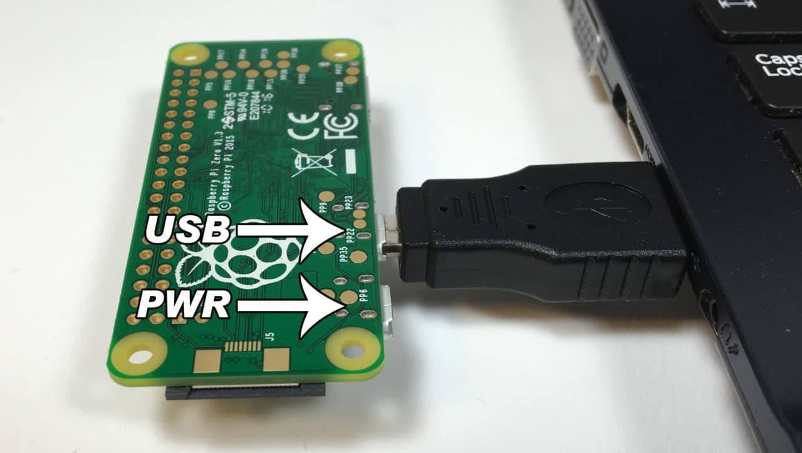

# Prototyping Workshop

This repository contains some material of my "Physical Prototyping" workshop.  

In the workshop I use a Raspberry Pi and Node-RED to show how easy it is to prototype hardware interactions. 

- Send push messages 
- Read Temperature and Humditiy
- Detecht a putton press
- Control a remote power plug
- Control a LED
- Build your own remote control (using [Blynk](https://www.blynk.cc/))
- Talk to the Pi (via Alexa)
- Chat with the Pi (via Telegram)
- Get weather information (via OpenWeatherMap)

You can view a subset of [the workshops slides](prototyping_masterclass_slides.pdf) here.  
In addition, you can find some basic information to get you started below.

## Things You Need

### Hardware Components
- Raspberry Pi Zero WH & case 
- mini USB cable and power adapter
- [a mini breadboard](https://www.amazon.de/Aukru-Superregeneration-Transmitter-Modul-receiver-module/dp/B00OLI93IC/)
- [jumperwire set](https://www.amazon.de/Female-Female-Male-Female-Male-Male-Steckbr%C3%BCcken-Drahtbr%C3%BCcken-bunt/dp/B01EV70C78/)
- [DHT11 Temperature Sensor](https://www.amazon.de/AZDelivery-Temperatur-Luftfeuchtigkeitssensor-Arduino-Raspberry/dp/B078S7FCZ9/)
- [433Mhz Transmitter & Receiver](https://www.amazon.de/Aukru-Superregeneration-Transmitter-Modul-receiver-module/dp/B00OLI93IC/)
- [pushbutton](https://www.amazon.de/Gaoxing-Tech-Miniatur-Momentary-Leiterplatte/dp/B06Y36YMF4/)
- [5mm neopixel LED](https://www.amazon.de/NEOPIXEL-THRU-DIFFUSE-ADAFRUIT-INDUSTRIES/dp/B01186GO4A/) (or a [clone](https://hackaday.com/2014/06/25/here-come-the-rgb-led-clones/), e.g. WS8212, WS8211, PD9823, ...)

*Note: Above are just sample links, I'd try to order most material from China to reduce the cost (with the exception of the Pi). 
The resulting total cost is around 30€.*

### Software
- SD Card Burner: [Etcher](https://etcher.io/) or [ApplePi Baker](https://www.tweaking4all.com/software/macosx-software/macosx-apple-pi-baker/) for Mac
- Terminal Manager: [puTTY](https://www.chiark.greenend.org.uk/~sgtatham/putty/latest.html) for Windows or [iTerm](https://iterm2.com/) for Mac
- IP Scanner: [Angry IP Scanner](http://angryip.org/download/) or [IP Scanner Home](https://itunes.apple.com/us/app/ip-scanner-home/id422293948) for Mac

### other things
- the SD card with the flashed image
- your credentials
  - your pi name: `protopi[nn].local`
  - login: `pi` | `pipapo`

*Note: The SD card contains a an image of [Raspian](https://www.raspberrypi.org/downloads/raspbian/), the Linux operating system for the Raspberry Pi, with some additions to it (SSH and headless mode is enabled, additional Pi nodes are installed, file access (SAMBA) is activated, etc.).*

## Getting Started

### Access your PI through USB

1. Connect you Pi to your computer      *Note: You need a "good" USB cable, one that you can sync your phone with*  

2. Follow the instructions for [Mac](https://www.thepolyglotdeveloper.com/2016/06/connect-raspberry-pi-zero-usb-cable-ssh/) or [Windows](http://www.circuitbasics.com/raspberry-pi-zero-ethernet-gadget/)  
  *Note: They also teach you how to use the Terminal, so give it a read*  
  
3. [Learn some additional commands](https://randomnerdtutorials.com/learning-basic-linux-commands-raspberry-pi-cheat-sheet/) for the command line

### Share your Internet Connection with the Pi (through USB)
- Follow these steps for the [Mac](https://www.mactip.net/share-internet-connection-mac/) and share the connection for the "RNDIS/Ethernet Gadget" (thats your the name of your Pi)
- For [Windows](https://www.wired.com/2015/07/share-not-share-wi-fi-windows-10/) follow the steps described [here](https://www.wired.com/2015/07/share-not-share-wi-fi-windows-10/)

### Add WiFi Credentials to the Pi
- [Follow](https://www.raspberrypi.org/documentation/configuration/wireless/wireless-cli.md) these steps
- Close the editor (CTRL + x and confirm with "y")
- To restart the Pi, type `sudo reboot -h now` in the console

### Is your Pi Online?
- You can either use your pi's name (`protopi[nn].local`) or its IP address
- Type `ping protopi[nn].local` in the Terminal (Mac) or on the command line (Windows)
- You should get a result with a time attaced to it, e.g.:   
  `64 bytes from 128.65.210.8: icmp_seq=1 ttl=59 time=14.428 ms`
- There you can also see the IP address of your Pi

### Access to Node-RED
- Enter `http://protopi[nn].local:1880` in the browser (Firefox or Chrome, please)
- You should find the *Pushover* flow, please remove my credentials and start tinkering

## Links and Resources
### Links
- [Pi Documentation](https://www.raspberrypi.org/documentation/)
- [Pi Operating System](https://www.raspberrypi.org/downloads/raspbian/)
- [Pi Zero Overview](https://learn.sparkfun.com/tutorials/getting-started-with-the-raspberry-pi-zero-wireless/all)
- [Node-Red](https://nodered.org/)
- [MagPi Magazine](https://www.raspberrypi.org/magpi/issues/)
  - [Raspberry Pi Beginners Book](https://www.raspberrypi.org/magpi/issues/beginners-1/)
  - [10 Raspberry Pi Projects You Must Make](https://www.raspberrypi.org/magpi/issues/61/)
  - [Pi Zero Projects](https://www.raspberrypi.org/magpi/issues/42/)
  - [Raspberry Pi Projects Book - Volume 2](https://www.raspberrypi.org/magpi/issues/projects-2/)
  - [Conquer the Command line](https://www.raspberrypi.org/magpi/issues/essentials-bash-vol1/)
- [Make: Magazin - Node Red Intro](https://www.heise.de/select/make/2016/14/1481475895404875) (German)

- [GPIO Pins Overview](https://pinout.xyz/)

### Introduction to Node-RED

